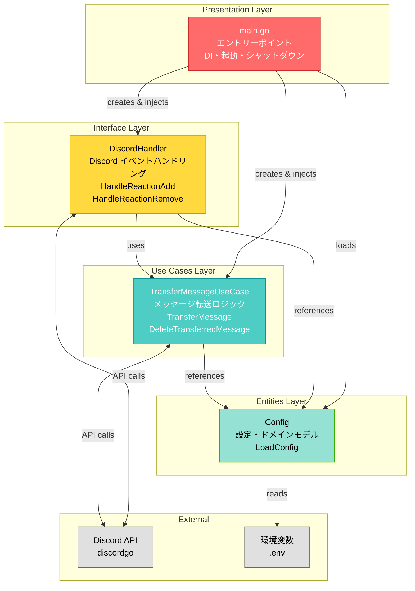

# Reaction Bot - アーキテクチャ

## アーキテクチャ図



## レイヤー責務

### Presentation Layer
- **main.go**: アプリケーションのエントリーポイント、依存関係の注入（DI）、Bot起動・シャットダウン

### Interface Layer
- **DiscordHandler**: Discordイベントのハンドリング、外部ライブラリ（discordgo）との接続

### Use Cases Layer
- **TransferMessageUseCase**: メッセージ転送のビジネスロジック、Discord API操作のカプセル化

### Entities Layer
- **Config**: 設定とドメインモデル、環境変数の読み込みとバリデーション

## 依存関係の方向

```
Presentation → Interface → Use Cases → Entities
```

各レイヤーは内側（下位）のレイヤーのみに依存し、外側（上位）のレイヤーに依存しない（クリーンアーキテクチャの原則）